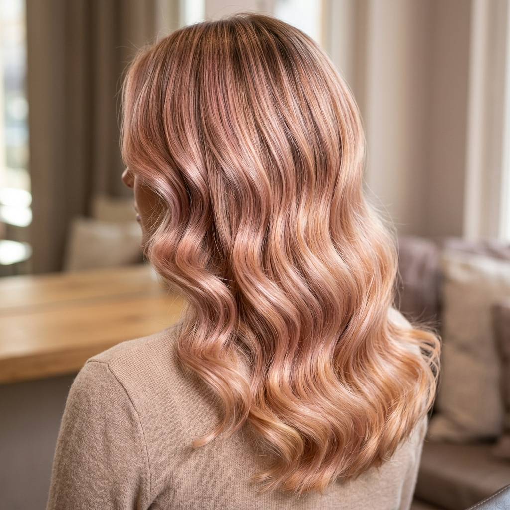

# 💇‍♀️ Pepa Peluquería — Landing Page


> **Estilismo capilar de alta gama en un espacio exclusivo.**  
> Landing page profesional para el salón de peluquería *Pepa Peluquería*, ubicado en Churriana, Málaga.


## 📋 Descripción

Aplicación web moderna y responsive desarrollada con **React + Vite** que funciona como la carta de presentación digital de la Peluquería. Permite a los clientes conocer los servicios, ver el trabajo del salón a través de una galería, leer opiniones reales, localizar el negocio en el mapa y **reservar citas directamente por WhatsApp** de forma rápida y sencilla.


## ✨ Características

| Funcionalidad | Descripción |
|---|---|
| 🧭 **Navegación fluida** | Menú responsive con anclaje a secciones |
| 🖼️ **Galería visual** | Muestra trabajos realizados (Balayage, Manicura, Recogidos) |
| 💇 **Servicios detallados** | Corte & Peinado, Coloración Premium con precios y duración |
| ⭐ **Testimonios** | Opiniones reales de clientes |
| 📍 **Mapa interactivo** | Ubicación del salón con Google Maps |
| 📱 **Reserva por WhatsApp** | Formulario de contacto que abre WhatsApp con los datos de la cita |
| 📱 **Diseño responsive** | Adaptado a móviles, tablets y escritorio |
| 🎨 **Estética elegante** | Fuentes Playfair Display + Inter, glassmorphism, animaciones suaves |


## 🛠️ Stack Tecnológico

| Tecnología | Versión |
|---|---|
| [React](https://react.dev/) | ^19.2.6 |
| [Vite](https://vitejs.dev/) | ^8.0.12 |
| [@vis.gl/react-google-maps](https://visgl.dev/) | ^1.8.3 |
| [Google Fonts](https://fonts.google.com/) | Playfair Display + Inter |
| ESLint | ^10.3.0 |


## 📸 Capturas

| Pantalla principal | Vista de servicios |
|---|---|
|  |  |


## 🚀 Instalación y uso

### Prerrequisitos

- **Node.js** v18 o superior
- **npm** (incluido con Node.js)

### Pasos

```bash
# 1. Clonar el repositorio
git clone https://github.com/SLB27/Peluqueria_Landing_Page.git
cd Peluqueria_Landing_Page

# 2. Instalar dependencias
npm install

# 3. Iniciar servidor de desarrollo
npm run dev
```

El proyecto se abrirá en `http://localhost:5173` (o el puerto que Vite asigne).

### Compilación para producción

```bash
npm run build
```

Los archivos estáticos se generarán en la carpeta `dist/`.

### Vista previa de producción

```bash
npm run preview
```


## 📁 Estructura del proyecto

```
peluqueria/
├── public/               # Archivos estáticos (imágenes, favicon, robots.txt)
│   ├── balayage.png
│   ├── banner.png
│   ├── favicon.png
│   ├── hero_salon.png
│   ├── icons.svg
│   ├── manicure.png
│   ├── robots.txt
│   ├── sitemap.xml
│   └── updo.png
├── src/
│   ├── components/       # Componentes React
│   │   ├── Navbar.jsx / .css
│   │   ├── Hero.jsx / .css
│   │   ├── Services.jsx / .css
│   │   ├── Gallery.jsx / .css
│   │   ├── Testimonials.jsx / .css
│   │   ├── Booking.jsx / .css
│   │   ├── Map.jsx / .css
│   │   └── Footer.jsx / .css
│   ├── App.jsx           # Componente principal
│   ├── index.css         # Estilos globales
│   └── main.jsx          # Punto de entrada
├── index.html
├── package.json
├── vite.config.js
├── eslint.config.js
└── README.md
```


## 📬 Contacto

| Canal | Enlace |
|---|---|
| 📍 **Dirección** | Calle Calamón, 29140 Churriana, Málaga |
| 📞 **Teléfono** | [+34 646 68 85 89](tel:+34646688589) |
| ✉️ **Email** | [pelukera82maria@gmail.com](mailto:pelukera82maria@gmail.com) |
| 📷 **Instagram** | [@lapepapeluqueria](https://www.instagram.com/lapepapeluqueria/) |


## 📄 Licencia

Este proyecto es de código abierto y está disponible bajo la licencia **MIT**.  
Desarrollado por [SLB27](https://github.com/SLB27).